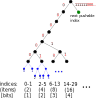

Quadrable is an authenticated multi-version database. It is implemented as a sparse binary merkle tree with compact partial-tree proofs. There are [C++](#c-library) and [Solidity](#solidity) libraries, as well as a git-like [command-line tool](#command-line).

<!-- TOC FOLLOWS -->
<!-- START OF TOC -->
* [Introduction](#introduction)
* [Building](#building)
  * [Dependencies](#dependencies)
  * [Compilation](#compilation)
  * [Tests](#tests)
* [Data Structure](#data-structure)
  * [Trees and Exponential Growth](#trees-and-exponential-growth)
  * [Merkle Trees](#merkle-trees)
  * [Keys](#keys)
  * [Sparseness](#sparseness)
  * [Collapsed Leaves](#collapsed-leaves)
  * [Splitting Leaves](#splitting-leaves)
  * [Bubbling](#bubbling)
* [Proofs](#proofs)
  * [Proofs and witnesses](#proofs-and-witnesses)
  * [Combined Proofs](#combined-proofs)
  * [Non-inclusion proofs](#non-inclusion-proofs)
  * [Strands](#strands)
  * [Commands](#commands)
  * [Proof encodings](#proof-encodings)
    * [External representation](#external-representation)
  * [Proof bloating](#proof-bloating)
* [Integer Keys](#integer-keys)
  * [Pushable Logs](#pushable-logs)
* [Storage](#storage)
  * [Copy-On-Write](#copy-on-write)
  * [Heads](#heads)
    * [Detached Head](#detached-head)
  * [LMDB](#lmdb)
  * [nodeId](#nodeid)
  * [nodeType](#nodetype)
  * [Node layout in storage](#node-layout-in-storage)
  * [Key tracking](#key-tracking)
* [Command-line](#command-line)
  * [quadb init](#quadb-init)
  * [quadb status](#quadb-status)
  * [quadb put](#quadb-put)
  * [quadb get](#quadb-get)
  * [quadb del](#quadb-del)
  * [quadb push](#quadb-push)
  * [quadb length](#quadb-length)
  * [quadb import](#quadb-import)
  * [quadb export](#quadb-export)
  * [quadb head](#quadb-head)
  * [quadb checkout](#quadb-checkout)
  * [quadb fork](#quadb-fork)
  * [quadb stats](#quadb-stats)
  * [quadb diff](#quadb-diff)
  * [quadb patch](#quadb-patch)
  * [quadb exportProof](#quadb-exportproof)
  * [quadb importProof](#quadb-importproof)
  * [quadb mergeProof](#quadb-mergeproof)
  * [quadb gc](#quadb-gc)
* [C++ Library](#c-library)
  * [LMDB Environment](#lmdb-environment)
  * [Character Encoding](#character-encoding)
  * [Managing Heads](#managing-heads)
  * [Operation Batching](#operation-batching)
    * [Batched Updates](#batched-updates)
    * [Batched Gets](#batched-gets)
  * [Pushing](#pushing)
  * [Exporting/Importing Proofs](#exporting/importing-proofs)
  * [Garbage Collection](#garbage-collection)
* [Solidity](#solidity)
  * [Smart Contract Usage](#smart-contract-usage)
    * [get](#get)
    * [put](#put)
    * [push](#push)
  * [Memory Layout](#memory-layout)
  * [Limitations of Solidity Implementation](#limitations-of-solidity-implementation)
  * [Gas Usage](#gas-usage)
* [Author and Copyright](#author-and-copyright)
<!-- END OF TOC -->

## Introduction

* *Authenticated*: The state of the database can be digested down to a 32-byte value, known as the "root". This represents the complete contents of the database, and any modifications will result in a new root. Anyone who knows the root value of a database can perform remote queries on it and be confident that the responses are authentic. To accomplish this, the remote server provides a [proof](#proofs) along with each response, which is validated against the root.
* *Multi-version*: Many different versions of the database can exist at the same time. Deriving one version from another doesn't require copying the database. Instead, all of the data that is common between the versions is shared. This [copy-on-write](#copy-on-write) behaviour allows very inexpensive database snapshots or checkpoints.

Although not required to use the library, it may help to understand the core data-structure used by Quadrable:

* *Merkle tree*: Each version of the database is a [tree](#trees-and-exponential-growth). The leaves of this tree are the inserted records which are combined together with calls to a cryptographic hash function, creating a smaller set of intermediate nodes. These intermediate nodes are then combined in a similar way to create a still smaller set, and this procedure continues until a single node is left, which is the root node. These "hash trees" are commonly called merkle trees, and they provide the mechanism for Quadrable's authentication.
* *Binary*: The style of merkle tree used by Quadrable combines together [exactly two](#merkle-trees) nodes to create a node in the next layer. There are alternative designs such as N-ary radix trees, AVL trees, and tries, but they are more complicated to implement and typically have a higher authentication overhead (in terms of proof size). With a few optimisations and an attention to implementation detail, binary merkle trees enjoy almost all the benefits of these alternative designs.
* *Sparse*: A traditional binary merkle tree does not have a concept of an "empty" leaf. This means that the leaves must be in a sequence, for example 1 through N (with no gaps). This raises the question about what to do when N is not a power of two. Furthermore, adding new records in a "path-independent" way, where insertion order doesn't matter, is difficult to do efficiently. Quadrable uses a [sparse](#sparseness) merkle tree structure, where there *is* a concept of an empty leaf, and leaf nodes can be placed anywhere inside a large (256-bit) key-space. This means that hashes of keys can be used directly as each leaf's location in the tree. Alternatively, Quadrable supports using [sequential integers as keys](#integer-keys) to implement an appendable log.

Values are authenticated by exporting and importing proofs:

* *Compact proofs*: In the classic description of a merkle tree, a value is proved to exist in the tree by providing a list of [witness](#proofs-and-witnesses) values as a proof. The value to be proved is hashed and then combined with the witnesses in order to reconstruct the hashes of the intermediate nodes along the path from the leaf to the root. If at the end of the list of witnesses you end up with the root hash, the value is considered authenticated. However, if you wish to authenticate multiple values in the tree at the same time then these linear proofs will contain duplicated hashes which wastes space. Additionally, some hashes that would need to be included with a proof for a single value can instead be calculated by the verifier. Quadrable's [proof encoding](#proof-encodings) never includes redundant sibling hashes, or ones that could be calculated during verification. It does this with a low overhead (approximately 0-6 bytes per proved item, not including sibling hashes).
* *Partial-trees*: Since the process of verifying a merkle proof reconstructs some intermediate nodes of the tree, Quadrable constructs a "partial-tree" when authenticating a set of values. This partial-tree can be queried in the same way as if you had the full tree locally, although it will throw errors if you try to access non-authenticated values. You can also make modifications on a partial-tree, so long as you don't attempt to modify a non-authenticated value. After an update, the new root of the partial-tree will be the same as the root would be if you made the same modifications to the full tree. Once a proof has been imported, additional proofs that were exported from the same tree can be merged in, expanding a partial-tree over time as new proofs are received. New proofs can also be generated *from* a partial-tree, as long as the values to prove are present (or were proved to *not* be present).

Quadrable is a [Log Periodic](https://logperiodic.com) project.

## Building

### Dependencies

The [LMDB](https://symas.com/lmdb/) library and header files are required. On Ubuntu/Debian run this:

    sudo apt install -y liblmdb-dev

### Compilation

Clone the repo, `cd` into it, and run these commands:

    git submodule update --init
    make -j

### Tests

You can run the tests like so:

    make test

* If you `make clean` prior to `make test` then a version of the `check` binary will be compiled with address sanitiser support.

You can view a coverage report of the tests by running:

    make coverage

* You will need `lcov` installed.
* The report will be in this file: `coverage-report/index.html`

## Data Structure

### Trees and Exponential Growth

The reason we use trees is because of the exponential growth in the number of nodes as the number of levels is increased. In other words, the number of intermediate nodes that must be traversed to get to a leaf grows much slower than the total number of nodes.

For some reason, computer science trees are usually drawn as growing in the downwards direction. Because of this, we use the term "depth" to refer to how many levels down you are from the top node (the "root").

### Merkle Trees

In a merkle tree, each node has a "nodeHash" which is formed by hashing the concatenation of its children nodeHashes. In Quadrable the tree is binary, so there are always exactly two children (except for leaf nodes, which have none). The order of the concatenation is important: The left child's nodeHash comes first, followed by the right child's:

The advantage of a merkle tree is that the nodeHash of the node at depth 0 (the top level) is a digest of all the other nodes and leaves. This top-level nodeHash is often just called the "root". As long as the tree structure is carefully designed, and the hash function is secure, any changes to the tree or its contents will result in a new, distinct root.

### Keys

In Quadrable's implementation of a merkle tree, keys are 256-bits long and these bits are used to traverse the tree to find the locations where the values are stored. A `0` bit means to use the left child of a node, and a `1` bit means use the right child:

When using Quadrable as a map (as opposed to a [log](#integer-keys)), keys are first hashed and these hashes are what are used to traverse the tree. Keys are hashed for multiple reasons:

* Keys of any length can be supported, since a hash will always return a fixed-size output.
* It puts a bound on the depth of the tree. Because Quadrable uses a 256-bit hash function, the maximum depth is 256 (although it will never actually get that deep since we [collapse leaves](#collapsed-leaves)).
* Since the hash function used by Quadrable is believed to be cryptographically secure (it behaves like a [random oracle](https://crypto.stackexchange.com/questions/22356/difference-between-hash-function-and-random-oracle)), the keys should be evenly distributed which reduces the average depth of the tree.
* It is computationally expensive to find two or more distinct keys whose hashes have long common prefixes, which an adversarial user might like to do to increase the cost of traversing the tree or [the proof sizes](#proof-bloating).

### Sparseness

Obviously creating a full tree with 2256 possible leaves is impossible. Fortunately, there is [an optimisation](https://www.links.org/files/RevocationTransparency.pdf) that lets us avoid creating this absurd number of nodes. If every empty leaf is encoded with the same value, then all of the nodes at the next level up will share the same hash. And since all these nodes have the same hashes, the nodes on the next level up from there will also have the same hashes, and so forth.

By caching the value of an empty sub-tree at depth N, we can easily compute the hash of the empty sub-tree at depth N-1. The technique of pre-computing values and caching them for later use instead of re-computing them as needed is called [dynamic programming](https://skerritt.blog/dynamic-programming/) and has been successfully applied to many graph and tree problems.

Quadrable makes two minor changes to this model of sparseness that help simplify the implementation:

1. An empty leaf is given a nodeHash of 32 zero bytes.
1. The hash function used when combining two child nodes has a special case override: Given an input of 64 zero bytes, the output is 32 zero bytes. Any other input is hashed as usual.

Because of the pre-image resistance property of our hash function, it is computationally infeasible to find another value for a leaf that has an all zero hash. Since the override is not used when hashing leaves (and also because of the different hashing domains, see the next section), it is also computationally infeasible to find a non-empty node that could be interpreted as a leaf, or vice versa.

The purpose of these changes is to make empty sub-trees at all depths have 32 zero bytes as their nodeHashes. This includes the root node, so a totally empty tree will have a root of 32 zeros. This is desirable because:

* The code is slightly simpler.
* All-zero roots are user-friendly: It's easy to recognize an empty tree.
* A run of zeros will compress better, so if empty tree roots are transmitted frequently as a degenerate case in some protocol, it may help for them to be all zeros.
* In some situations, like an Ethereum smart contract, using all zero values allows some minor optimisations. Specifically, 0 bytes in the calldata are cheaper on gas, contract code size is reduced because pre-calculated empty node values can be omitted, and "uninitialised" memory can be used for some operations. It does not save on storage loads though -- only a naive implementation would cache empty values in storage as opposed to contract code.

### Collapsed Leaves

Although using the sparseness optimisation described above makes it feasible to simulate a binary tree with a depth of 256, it still would require us to traverse 256 nodes to get to a leaf. Adding a new leaf would require calling the hash function 256 times and creating 256 new nodes.

In order to reduce this overhead, Quadrable uses another optimisation called *collapsed leaves*. In this case, whenever a sub-tree contains exactly one non-empty leaf node (implying all the others are empty), this sub-tree is not stored or computed. Instead, only the non-empty leaf is stored. If the leaf is collapsed at depth N, then only N intermediate nodes need to be traversed to get to it from the root.

* Leaves must always be collapsed at the highest possible level to ensure that equivalent trees have equivalent roots.
* In Quadrable, there is no such thing as a non-collapsed leaf: All leaves are collapsed. For a leaf to reach the very bottom level, there would need to be two distinct keys with the same keyHash (except for the last bit). The collision-resistance property of our hash function allows us to assume this will never happen.

An issue with collapsing leaves is that we could lose the ability to distinguish which of the leaves in the sub-tree is the non-empty one. We could not create proofs for these leaves since other people would not be able to detect if we had "moved around" the leaf within the sub-tree.

In order to prevent this, Quadrable hashes the path information (that is, the keyHash) along with the leaf's value when computing a collapsed leaf's nodeHash:

    leafNodeHash = H(H(key) || H(value) || '\0')

* The hashed key is 32 bytes and represents the path from the root to the leaf.
* The hashed value is also 32 bytes, and represents the value stored in this leaf.
* `'\0'` is a single zero byte (see below).

There are two reasons for using the hash of the value rather than the value itself:

* For [non-inclusion proofs](#non-inclusion-proofs) it is sometimes necessary to send a leaf along with the proof to show that a different leaf lies along the path where the queried leaf exists. In this case, where the verifier doesn't care about the contents of this "witness leaf", we can just include the hash of the value in the proof, which could potentially be much smaller than the full value. Whether to include the full value or just a witness is a proof-creator decision, and it may be better to send the full leaf if the value is smaller than 32 bytes. Note that in either case the verifier still has enough information to move the leaf/witness leaf around in a partial-tree, allowing it to be split or bubbled (see next sections).
* Combined with the zero byte, this ensures the input when hashing a leaf is always 65 bytes long. By contrast, the input when hashing two nodeHashes to get the parent's nodeHash is always 64 bytes. This achieves a domain separation so that leaves can not be reinterpreted as interior nodes, nor vice versa.

### Splitting Leaves

Since a collapsed leaf is occupying a spot high up in the tree that could potentially be in the way of new leaves with the same key prefix, during an insertion it is sometimes necessary to "split" a collapsed leaf. A new branch node will be added in place of the collapsed leaf, and both leaves will be inserted further down underneath this branch. 

In this figure, the leaf being split is coloured blue and the newly added nodes are green:

Sometimes splitting a leaf will result in more than one branch being added. This happens when the leaf being added shares additional prefix bits with the leaf being split. These extra intermediate branches each an have empty node as one of their children.

Quadrable does not store empty nodes. In the C++ implementation there are special [node types](#nodetype) to indicate if either of the children are empty sub-trees. These are the types of branch nodes:

* Branch Left: The right node is empty.
* Branch Right: The left node is empty.
* Branch Both: Neither are empty.

### Bubbling

Because of collapsed leaves, the existence of a branch implies that there are at least 2 leaves somewhere below it. Since an important requirement is that equivalent trees have equivalent roots, we must maintain this invariant when a leaf is deleted.

In order to keep all leaves collapsed to the lowest possible depth, a deletion may require moving a leaf several levels further up, potentially even up to the root (if it is the only remaining leaf in the tree). This is called "bubbling" the leaf back up:

**Note**: Creating proofs with sufficient information to support a deletion is not yet implemented. The proof creation code needs to determine which leaf nodes will be bubbled and provide them as separate WitnessLeaf strands. It would also help to implement WitnessBranch strand types to efficiently prove that a sub-tree has two or more children and therefore bubbling can stop at this level.

## Proofs

So far the data-structure we've described is just an expensive way to store a tree of data. The reason why we're doing all this hashing in the first place is so that we can create *proofs* about the contents of our tree.

A proof is a record from the tree along with enough information for somebody who does not have a copy of the tree to reconstruct the root. This reconstructed root can then be compared with a version of the root acquired elsewhere, from a trusted source. Some possible ways to transmit a trusted root are:

* Published in a newspaper
* Broadcast from a satellite
* Embedded in a blockchain

The purpose of using a tree structure is to make the size of a proof proportional to the depth of the tree, and not the total number of leaves.

### Proofs and witnesses

When you would like to query the database remotely, do the following steps:

* Acquire a copy of the root hash (32 bytes) from a trusted source.
* Hash the key of the record you would like to search for. Let's say you're looking for the record `"John Smith"` and it hashes to `1011` in binary (using a 4-bit hash for sake of explanation, normally this would be 256 bits). This is the path that will be used to traverse the tree to this record.
* Ask a (potentially untrusted) provider who has the full data-set available to send you the value for the record that has this hash. Suppose they send you a JSON blob like `{"name":"John Smith","balance":"$200",...}`.

At this point you have a value, but you can't be sure that it wasn't tampered with. Maybe John's balance is actually "$0.05", or perhaps there isn't a record for John Smith at all.

In order to convince you that the record exists and is correct, the provider must send a proof along with the JSON. You can use this proof to re-compute the root hash and see if it matches the trusted root hash you acquired earlier. First compute the leaf hash. In Quadrable you do that by hashing the JSON value and combining it with the key's hash (see [collapsed leaves](#collapsed-leaves)).

Next, you must compute the hash of the leaf's parent node. To compute this you need to know the hash of the leaf's sibling node, since the parent is the hash of the concatenation of these two children. This is solved by having the provider send this value (called a *witness*) as part of the proof:

Now you need to compute the next parent's hash, which requires another witness. This continues on up the tree until you reach the top:

* Whether the witness is the left child or the right child depends on the value of the path at that level. If it is a `1` then the witness is on the left, since the value is stored underneath the right node (and vice versa). You can think of a witness as a sub-tree that you don't care about, so you just need a summarised value that covers all of the nodes underneath it.
* There is a witness for every level of the tree. Since Quadrable uses collapsed leaves, this will be less than the full bit-length of the hash. [If we can assume](#proof-bloating) hashes are randomly distributed, then this will be roughly log2(N): That is, if there are a million items in the DB there will be around 20 witnesses. If there are a billion, 30 witnesses (this slow growth in witnesses relative to nodes illustrates the beauty of trees and logarithmic growth).
* The final computed hash is called the "candidate" root. If this matches the trusted root, then the proof was successful and we have verified the JSON value is accurate. Consider why this is the case: For a parent hash to be the same as another parent hash, the children hashes must be the same also, because we assume nobody can find collisions with our hash function. The same property then follows inductively to the next set of child nodes, all the way until you get to the leaves. So if there is any alteration in the leaf content or the structure of the tree, the candidate root will be different from the trusted root.

### Combined Proofs

The previous section described the simple implementation of merkle tree proofs. The proof sent would be those 4 blue witness nodes, usually in order from deepest to the root since this is how they will be accessed. To do the verification, it's just a matter of concatenating (using the corresponding bit from the path to determine the order) and hashing until you get to the root. The yellow nodes in the above diagrams are computed as part of verifying the proof.

This is pretty much as good as you can do with the proof for a single leaf (except perhaps to indicate empty sub-trees somehow so you don't need to send them along with the proof).

However, suppose we want to prove multiple values at the same time. Trivially, we could request separate proofs for each of them. Here are two proofs for different leaves:

To prove both of these values independently, the proofs need 8 witnesses in total. However, observe the following:

* Since we are authenticating values from the same tree, the top two witnesses in the second proof will be the same as the top two in the first proof, and are therefore redundant.
* On the third level, the node that was sent as a witness in one proof is a computed node in the other proof, and vice versa. Since the verifier is going to be computing these values anyway, there is no need for the proof to contain *any* witnesses for this level.

After taking these observations into account, we see that if we are sending a combined proof for these two leaves, we actually only need to send 4 witnesses:

By the way, consider the degenerate case of creating a proof for *all* of the leaves in a tree. In this case, no witnesses need to be sent whatsoever, since the verifier will be constructing the entire tree. Also, nothing additional would need to be sent to prove that a record does *not* exist, since the verifier has the entire set and could just check to see that it is not present.

### Non-inclusion proofs

So far we have discussed proving that a queried value *exists* in the database. For many applications it is also necessary to prove that a value does *not* exist. These are called "non-inclusion proofs".

In a pure sparse merkle tree, every leaf is conceptually present in the tree, even if it is empty. In such systems it would be sufficient to provide an existence proof for the corresponding empty leaf. However, Quadrable uses the collapsed leaf optimisation which means that this will not work since the paths to the empty leaves might be blocked by collapsed leaves. Because of this, non-inclusion proofs are slightly more complicated, however this complexity is more than made up for by the reduction in proof sizes and the amount of hashing required.

To create a non-inclusion proof, Quadrable uses one of two methods, depending on the structure of the tree and the key hash of the queried record.

The first method is to present a branch where the corresponding child node is occupied by an empty sub-tree value (all zeros):

* Note: As an optimisation, when providing the keyHash for a non-existing leaf in an empty non-inclusion proof the keyHash has its trailing bits zeroed out. For instance, in the diagram above, the record to be proven to not exist could have the key hash `101100101111001...` but the proof would instead prove that the record with key hash `101000000000000...` does not exist. This results in the same partial-tree, however the encoded proof contains trailing zero bytes which are compressed away in the [HashedKeys proof encoding](#proof-encodings).

The second method is to present a leaf node that is on the corresponding path, but has a different key hash. This conflicting leaf is called a "witness leaf":

Both of these methods are proved in the same way as inclusion proofs: There is an untrusted value that will be hashed and then combined with witnesses up the tree until a candidate root node is reached. If this candidate root matches the trusted root then the non-inclusion proof is satisifed.

In fact, at the proof level there is *no such thing* as a non-inclusion proof. The proofs provide just enough information for the verifier to construct a tree that they can use to determine the key they are interested in does not exist.

Witness leaves are like regular proof-of-inclusion leaves except that a hash of the leaf's value is provided, not the leaf's value itself. This is because the verifier is not interested in this leaf's value (which could be large). Instead, the verifier merely wishes to ensure that this other leaf is blocking the path to where their queried leaf would have lived in the tree. Note that it is possible for a leaf to be used for a non-inclusion proof instead of a witness leaf. This can happen if a query requests the value for this leaf *and* for a non-inclusion proof that can be satisifed by this leaf. In this case there is no need to send a witness leaf since the leaf can be used for both.

### Strands

Quadrable's proof structure uses a concept of "strands". This allows us to reduce the proof size when multiple records (inclusion or non-inclusion) are to be proved from the same DB. It is similar to the [authentication octopus algorithm](https://eprint.iacr.org/2017/933.pdf), except that the tentacles can be different lengths which is necessary for our [collapsed leaves](#collapsed-leaves) optimisation. Also, it doesn't necessarily work on all the strands from the bottom up (this is up to the proof encoder, which usually works on one strand as much as possible before switching to another).

The algorithm isn't necessarily optimal, but it seems to result in fairly compact proofs which can be shrunk further with extra proof-time optimisations. Additionally, the proofs can be processed with a single pass in resource-constrained environments such as smart contracts. After processing a proof, you end up with a ready-to-use partial-tree.

Each strand is related to a record whose value (or non-inclusion) is to be proven. Note that in some cases there will be fewer strands than records requested to be proven. This can happen when a witness on a strand reveals an empty sub-tree that is sufficient for satisfying a non-inclusion proof for a different requested value.

A Quadrable proof includes a list of strands, *sorted by the hashes of their keys*. Each strand contains the following:

* Hash of the key, or (optionally) the key itself
* Depth
* Strand type, which is one of the following:
  * Leaf: A regular leaf value, suitable for satisfying a get or update request
  * WitnessLeaf: A leaf value, suitable for proving non-inclusion
  * WitnessEmpty: An empty sub-tree, suitable for proving non-inclusion
* Value, the meaning of which depends on the record type:
  * Leaf: The leaf value (ie the result of a get query)
  * WitnessLeaf: The hash of the leaf value
  * WitnessEmpty: Unused

Note that WitnessLeaf strands must have their keyHash and valueHash included in a proof so the verifier can compute the nodeHash. It would not be sufficient to pass in the nodeHash, because this would allow an attacker to take the nodeHash of a branch and present it as a WitnessLeaf. This "Leaf" could then be used to create counterfeit non-inclusion proofs for elements underneath the branch. For a similar reason, if future "WitnessBranch" node types are implemented, the nodeHashes of both children must be provided by the proof.

The first thing the verifier should do is run some initial setup on each strand (although this can be done lazily on first access instead, if desired):

* Hash the key (if key was included)
* Compute the strand's nodeHash: If the record type is Leaf or WitnessLeaf, compute the leaf nodeHash. If WitnessEmpty, then the nodeHash is [all-zeros](#sparseness)
* Set a `merged` boolean value to `false`
* Set a `next` index value to `i+1` where `i` is the node's index in the list, or an empty sentinel for the last strand (for example `-1`, or the index immediately following the last strand's index). This functions as a singly-linked list of unmerged strands

### Commands

In addition to the list of strands, a Quadrable proof includes a list of commands. These are instructions on how to process the strands. After running the commands, all the strands will have been merged into one strand and the root will be reconstructed. Assuming this candidate root matches the trusted root, the proof is considered verified.

Every command specifies a strand by its index in the strand list. After running a command this strand's depth will decrease by 1.

There are 3 types of commands ("ops"):

* `HashProvided`: Take the provided witness, concatenate it with the specified strand's nodeHash, and hash, storing the result into this strand's nodeHash. The order of concatenation depends on the bit of the strand's keyHash at position `depth`.
* `HashEmpty`: The same as the previous, but there is no provided witness. Instead, the empty sub-tree nodeHash (32 zero bytes) is used.
* `Merge`: Take this strand's nodeHash and concatenate and hash it with the nodeHash of the next un-merged strand in the strand list, which can be found by looking at the `next` linked list.
  * Check that the `merged` flag is false in the `next` strand, and that both strands are at the same depth.
  * After the merge, set the `merged` flag to true in the `next` strand, and unlink it from the linked list.

After processing all commands, implementations should check the following:

* The first strand has an empty `next` linked list, meaning all strands have merged into the left-most strand
* The first strand has a depth of 0, meaning it has reached the root
* The first strand's nodeHash is equal to the trusted root

While processing commands, implementations should be creating nodes along the way for later querying. Technically this is optional and an implementation could just verify the root hash and then rely on the values included in the initial strand data. However, it is easier to make security-related mistakes with this approach. For example, suppose an implementation forgets to check that the first strand has an empty `next` linked list after processing the proof. In this case, an unauthenticated value could be in the initial strands that was never merged into the root. The tree-construction method "fails safe" in the presence of this mistake (among others) since this unauthenticated value will never get added to the created tree used for querying.

Furthermore, a tree structure will be useful when computing a new root after making insertions and updates. If you do support building a partial-tree to do this, any other handling of the strand values is duplicated code, which should be avoided. This suggests that constructing the partial-tree while verifying the proof is ideal.

### Proof encodings

There are a variety of ways that merkle-tree proofs can be encoded (whether using the strands model or otherwise). The Quadrable C++ library has a conceptual separation between a proof and its encoding. There is a `quadrable::Proof` class, and it contains an abstract description of the proof. In order to serialise this to something that can be transmitted, there is a separate `encodeProof()` function. This function takes two arguments: The proof to encode and the encoding type. So far we have the following encoding types:

* `HashedKeys` (0): An encoding where the hashes of keys are included in the proof. Each "hash" is prefixed with a byte that indicates the number of trailing 0 bytes in the hash. This number of 0 bytes must be appended to the provided value to bring it up to 32 bytes. This is useful for reducing the size of keys that are not hashes, in particular [integer keys](#integer-keys), and non-inclusion witnesses. Since this byte has a maximum value of 32, it can be extended to enable possible future key encodings.
* `FullKeys` (1): Full keys (instead of the key hashes) are included in the proof. These proofs may be larger (or not) depending on the sizes of your keys. They will take slightly more CPU to verify than the no-keys version, but at the end you will have a partial-tree that supports [enumeration by key](#key-tracking). These proofs can only be created from a tree that has key tracking enabled.

Although new Quadrable proof encodings may be implemented in the future, the first byte will always indicate the encoding type of an encoded proof, and will correspond to the numbers in parentheses above. Since the two encoding types implemented so far are similar, we will describe them concurrently and point out the minor differences as they arise.

Unlike the C++ implementation which first decodes to the `quadrable::Proof` intermediate representation, the Solidity implementation directly processes the external representation.

#### External representation

The first byte is the proof encoding type described above. It is followed by serialised lists of strands and commands:

    [1 byte proof encoding type]
    [ProofStrand]+
    [ProofCmd]*

* The sort order is significant for both lists. For strands it must be sorted by keyHash (even with `FullKeys` proofs where keys are included instead of keyHashes). For commands the order is the sequence that the commands will be processed.
* At the end of the lists of strands, a special "Invalid" strand signifies the end of the strand list, and that the commands follow.
* The commands are just processed until the end of the encoded string.

Here is how each strand is encoded:

    [1 byte strand type, Invalid means end of strands]
    [1 byte depth]
    if Leaf
      if HashedKeys:
        [1 byte number trailing 0s in keyHash]
        [32 byte keyHash]
      else if FullKeys:
        [varint size of key]
        [N-byte key]
      [varint size of val]
      [N-byte val]
    else if WitnessLeaf
      [1 byte number trailing 0s in keyHash]
      [32 byte keyHash]
      [32 byte valHash]
    else if WitnessEmpty
      [1 byte number trailing 0s in keyHash]
      [32 byte keyHash]

* A varint is a BER (Binary Encoded Representation) "variable length integer". Specifically, it is the base 128 integer with the fewest possible digits, most significant digit first, with the most significant bit set on all but the last digit.
* The "number of trailing 0s" fields affect the following keyHashes which allows keyHashes to take up less space if they have trailing 0 bytes. This is useful for [pushable logs](pushable-logs) since they use integer keys which are much shorter than hashes.
* The strand types are as follows:
  * `0`: Leaf (chosen to be 0 since this is probably the most common, and 0 bytes are cheaper in Ethereum calldata)
  * `1`: Invalid
  * `2`: WitnessLeaf
  * `3`: WitnessEmpty

The abstract version of a proof described in the previous section provides each command a strand index to work on. The compact encoding instead maintains a current "working strand" variable that stores an index into the strands. There are jump commands that alter this index, so that subsequent non-jump commands will work on other strands. The initial value of the working strand is the *last* (right-most) strand. This was an arbitrary choice, but usually the strands are worked on starting at the right because left strands survive longer (the left-most one always becomes the final strand).

The encoded commands are 1 byte each, and they do not correspond exactly with the commands described previously, although there is a straightforward conversion between the two. Here are the commands:

    hashing/merging: 0[7 bits hashing details, all 0 == merge]
     short jump fwd: 100[5 bits distance]   jumps d+1, range: 1 to 32
     short jump rev: 101[5 bits distance]   jumps -(d+1) range: -1 to -32
      long jump fwd: 110[5 bits distance]   jumps 2^(d+6) range: 64, 128, 256, 512, ..., 2^37
      long jump rev: 111[5 bits distance]   jumps -2^(d+6) range: -64, -128, -256, -512, ..., -2^37

If the most significant bit of a command byte is 0, it is a hashing/merging command. These 7 bits specify a sequence of either hashing with a provided witness value or an empty sub-tree (32 zero bytes).

* Only 6 or fewer of the bits can actually be used for hashing directives. These bytes are padded with `0` bits, starting from the *least* significant bit, until a marker `1` bit is seen. The remaining bits are the hashing specifiers: `0` means empty and `1` means provided witness. This way between 1 and 6 hashes can be applied per hashing byte.
* The witnesses are provided inline, that is they are the 32 bytes directly after the command byte. These 32 bytes are then skipped over and the next command is the following byte (unless more witnesses follow in this same command).
* If all 7 bits in the hashing details are `0` (there is no marker bit) then the command says to merge this strand with the next unmerged strand (which can be found via the `next` linked list). In the `next` strand, `merged` is set to true and this strand is unlinked.

If the most significant bit is `1` in a command byte, it is a jump:

* A short jump adds 1 to the distance and adds/subtracts this from the working strand
* A long jump adds 6 to the distance, and adds/subtracts that power of two from the working strand. This allows a proof to rapidly jump nearby to the next desired strand, even if there are huge numbers of strands. It can then narrow in with subsequent long jumps until it gets within 32, and then use a short jump to go to the exact strand. This is sort of like a varint implementation, but fits into the simple "1 byte per command" model, and doesn't permit representation of zero-length jumps (which would be pointless to support)
* Implementations must check to make sure that a jump command does not jump outside of the list of strands. I though about making them "wrap around", which could allow some clever encoding-time optimisations, but the added complexity didn't seem worth it.

### Proof bloating

Since the number of witnesses is proportional to the depth of the tree, given a nicely balanced tree the number of witnesses needed for a proof of one value is roughly the base-2 logarithm of the total number of nodes in the tree. Thanks to the beauty of logarithmic growth, this is usually quite manageable. A tree of a million records needs about 20 witnesses. A billion, 30.

However, since our hashes are 256 bits long, in the worst case scenario we would need 255 witnesses. This happens when all the bits in two keyHashes are the same except for the last one (if *all* the bits were the same with two distinct keys, then records would get overwritten and the data structure would simply be broken). Fortunately, it is computationally expensive to find long shared hash prefixes.

In fact, this is one of the reasons we make sure to hash keys before using them as paths in our tree. If users were able to present hashes of keys to be inserted into the DB without having to provide the corresponding preimages (unhashed versions), then they could deliberately put values into the DB that cause very long proofs to be generated (compare also to [DoS attacks based on hash collisions](https://lwn.net/Articles/474912/)).

If keys can only be selected by trusted parties, then it may make sense to use special non-hash values for keys. This could considerably reduce proof overhead if values commonly requested together are given keys with common prefixes. Quadrable does not yet support this, but it could in the future (trivially, if keys are restricted to exactly 256 bits).

So why are we worried about deep trees and their correspondingly larger proof sizes? The worst case overhead for proving a single value is around 8,000 bytes and a couple hundred calls to the hash function, which is of course trivial for modern networks and CPUs. The issue is that the proof size and computational overhead of verification is part of the security attack surface for some protocols. For instance, if in an [optimistic rollup](https://docs.ethhub.io/ethereum-roadmap/layer-2-scaling/optimistic_rollups/) system verifying a fraud proof requires more gas than is allowed in a single block, then an attacker can get away with fraudulent transactions. The best solution to this is to keep the fraud-proof units granular enough that even heavily bloated proofs can be verified with a [reasonable amount of gas](#gas-usage). Counter-intuitively, this also means it is important for verification code to be gas-efficient, even if it is expected to rarely be called during normal operation of the protocol.

For a point of reference regarding how expensive it is to bloat proof sizes, at the time of writing Bitcoin block hashes start with about 75 leading 0 bits. Generating one of these earns about US $70,000. Unfortunately, for our situation we need to make a distinction. Bitcoin miners are specifically trying to generate block hashes with leading 0 bits (well, technically below a particular target value, but close enough). If somebody is trying to created bloated proofs, it may be sufficient to find *any* two keys with long hash prefixes. These attacks are easier because of the birthday effect, which is the observation that it's easier to find any two people with the same birthday than it is to find somebody with a specific birthday.

Depending on the protocol though, there may be more value in generating partial collisions for particular keys. You can imagine an attacker specifically trying to bloat a victim key so as to cause annoyance or expense to people who verify this key frequently.

There is a `quadb mineHash` command to help brute force search for a key that has a specific hash prefix. This is useful when writing tests for Quadrable, so that you can build up the exact tree you need.

One interesting consequence of the [caching optimisation](#sparseness) that makes sparse merkle trees possible is that it is unnecessary to send empty sub-tree witnesses along with a proof. A single bit suffices to indicate whether a provided witness should be used, or a default hash instead. The nice thing about this is that finding a single long shared keyHash prefix for two keys doesn't really bloat the proof size that much (but it does still increase the hashing overhead). To fully saturate the path, you need partial collisions at every depth. Unfortunately, exponential growth works *against* us here. To find an N-1 bit prefix collision is only half the work of finding an N bit one (in the specific victim key case). Summing the repeated fraction indicates that saturating the witnesses only approximately doubles an attacker's work (and in the birthday attack case they might get this as a free side effect).

## Integer Keys

Quadrable includes a wrapper for efficiently using the sparse merkle tree with integer keys. In this case, the keys are *not* hashed prior to inserting into the tree. Instead, a special encoding for integers is used which arranges them in a convenient layout within the tree:

The key layout works by having a sequence of sub-trees, each of which is twice as large as the previous. The top 6 bits provide paths to the various sub-trees, and there is a special location that stores the next pushable index (`0xFC0000...`, or `1111110000...` in binary).

* The items are sorted in the tree by key. As well as allowing in-order iteration, proofs for adjacent keys becomes much smaller because of Quadrable's [combined proofs](#combined-proofs) algorithm.
* Up to `2^64 - 3` items are supported.
* If we start sequentially inserting at index 0, the average height of the tree grows as more elements are inserted, and trees aren't excessively deep when the number of items is small. An alternative approach might be to use the full 64-bits of an integer as a key (MSB first). Unfortunately, this would create a tree of depth 64 even with only 2 elements.

### Pushable Logs

A common use-case for integer keys is to maintain an appendable list, also known as a *log*. To append items you should use the `push` methods which will manage a special *next pushable index* field. This field contains an increasing integer that can be used to find the next index available to be pushed to, stored as a varint (same format as described [above](#external-representation)).

In order to create a proof that can be pushed onto, pass the `--pushable` flag to `quadb exportProof` (or set the `pushable` parameter of `exportProofInteger` to `true` in C++). This adds the following to the proof (in addition to any other indices you requested):

* An inclusion proof for the next pushable index field (or a non-inclusion if it's not yet set)
* A non-inclusion proof for the value stored in the next pushable index field (or `0` if next pushable not yet set)

Partial trees that are constructed from these proofs allow an unlimited number of elements to be appended (pushed). Do *not* use both integer keys and hashed keys in the same tree. If you do, then the pushable proofs may not contain enough information to push an unlimited number of elements.

Pushable proofs are fairly compact. For example, a database with 1 million elements in it has a pushable proof of about 300 bytes:

    $ quadb checkout
    $ perl -E 'for $i (1..1_000_000) { say "value $i" }' | quadb push --stdin
    $ quadb exportProof --pushable | wc -c
    310

Because consecutive keys are often adjacent in the tree they can take good advantage of [combined proofs](#combined-proofs). This means that proofs for consecutive ranges of keys are also compact:

    $ perl -E 'for $i (1_000..1_999) { say $i }' | quadb exportProof --int --stdin | wc -c
    18010

The values alone (`value 1000`, `value 1001`, ...) take up 10,000 bytes, meaning the proof and encoding overhead is around 8,000 bytes (8 bytes per item, *including* all sibling hashes). (We're using `--int` instead of `--pushable` to avoid the pushable overhead, but that's only another 200 bytes or so).

By contrast, if the keys are at random locations in the tree as per their hash values, the proofs become much larger:

    $ quadb checkout
    $ perl -E 'for $i (1..1_000_000) { say "$i,value $i" }' | quadb import
    $ perl -E 'for $i (1_000..1_999) { say $i }' | quadb exportProof --stdin | wc -c
    349981

## Storage

### Copy-On-Write

In the diagrams above it shows nodes in the tree being modified during an update. This makes it easier to explain what is happening, but is not actually how the C++ implementation stores its data. To support multiple-versions of the tree, nodes are never modified. Instead, new nodes are added as needed, and they point to the old nodes in the places where the trees are identical.

In particular, when a leaf is added/modified, all of the branches on the way back up to the root need to be recreated. To illustrate this, here is the example from the [splitting leaves section](#splitting-leaves), but showing all the nodes that needed to be created (green), and how these nodes point back into the original tree (dotted lines):

Notice how references to the original tree remain valid after the update.

This copy-on-write behaviour is why our diagrams have the arrows pointing from parent to child. Most descriptions of merkle trees have the arrows pointing the other direction, because that is the direction the hashing is performed (you must hash the children before the parents). While this is still of course true in Quadrable, in our case we decided to draw the arrows indicating how the nodes reference each-other. This is also the order of traversal when looking up a record.

Since leaves are never deleted during an update, they can continue to exist in the database even when they are not reachable from any head (version of the database). These nodes can be cleaned up with a run of the [garbage collector](#garbage-collection). This scans all the heads to find unreachable nodes, and then deletes them.

### Heads

The way that copy-on-write is exposed is via "heads". These are sort of like the concept of "branches" in git. You have a current working head that is used to satisfy your read operations, and is affected by your write operations.

At any moment in time, a head is pointing to a particular root in the database. When you make a modification, a new root results and your current head is updated to point to this root.

A database can have many heads simultaneously, and it is very cheap to switch between heads and to create new ones. Here are the ways to do that:

* [checkout](#quadb-checkout): This switches your current working head to another head whose name you provide. If this head does not exist, it is created and starts as an empty tree. If you provide no name at all, a new [detached head](#detached-head) is created.
* [fork](#quadb-fork): This is like checkout, except that it overwrites the head whose name you provide with a copy of your current head (unless another is specified with `--from`). Similarly, if you don't provide a head name, it is forked to a detached head.

The command-line application keeps a separate LMDB table that maintains a database-global pointer to your current working head. This means that you should avoid using the command-line application with concurrent processes. The C++ library maintains the current working head as a part of its database object though, so every process/thread has its own private current working head.

#### Detached Head

A detached head is just a root that doesn't exist in the `quadrable_head` table. You can think of it like a temporary working head.

Detached heads are indicated like this in [quadb head](#quadb-head):

    $ quadb head
    D> [detached] : 0x9b497122189e5c9a3b8ff465ee3ab206c3c08b7984ae79805cefe7cb5e4cc38e (4472284)

If you switch to another head, your detached head will be lost, so if you want to keep this data make sure you save it by forking.

    $ quadb fork saved-head
    $ quadb head
    => saved-head : 0x9b497122189e5c9a3b8ff465ee3ab206c3c08b7984ae79805cefe7cb5e4cc38e (4472284)

The command-line application keeps the current working head in a database-global table which is crawled by garbage collection, so garbage collection won't destroy the detached head checked out in the command-line app. However, this is not the case for the C++ implementation. In this case, detached heads should not outlive transactions if there is a chance that garbage collection could be run by another thread.

### LMDB

Because traversing Quadrable's tree data-structure requires reading many small records, and this usually cannot be parallelised or pipelined, it is very important to be able to read records quickly and efficiently.

Quadrable's C++ implementation uses the [Lightning Memory-mapped Database](https://symas.com/lmdb/). LMDB works by memory mapping a file and using the page cache as shared memory between all the processes/threads accessing the database. When a node is accessed in the database, no copying or decoding of data needs to happen. The node is already "in memory" and in the format needed for the traversal.

LMDB is a B+ tree database, unlike Log-Structured-Merge (LSM) databases such as LevelDB. Compared to LevelDB, LMDB has better read performance and uses the CPU more efficiently. It has instant recovery after a crash, suffers from less write amplification, offers real ACID transactions and multi-process access (in addition to multi-thread), and is less likely to suffer data corruption.

LMDB supports multi-version concurrency control (MVCC). This is great for concurrency, because writers don't block readers, and readers don't block anybody (in fact there are no locks or system calls at all in the read path). But yes, this does mean that Quadrable has built a copy-on-write layer on top of a copy-on-write database. This is necessary because LMDB's MVCC snapshots are not persistent (they cannot outlive a transaction), and because our nodes are more granular than LMDB's B+ tree pages.

### nodeId

Some implementations of hash trees store leaves and nodes in a database keyed by the node's hash. This has the nice property that records are automatically de-duplicated. Since a collision-resistant hash function is used, if two values have the same hash they can be assumed to be identical. This is called [content-addressable storage](https://git-scm.com/book/en/v2/Git-Internals-Git-Objects).

Quadrable does not do this. Instead, every time a node is added, a numeric 64-bit incrementing `nodeId` is allocated and the node is stored with this key. Although records are not de-duplicated, there are several advantages to this scheme:

* Nodes are clustered together in the database based on when they were created. This takes advantage of the phenomenon known as [locality of reference](https://medium.com/@adamzerner/spatial-and-temporal-locality-for-dummies-b080f2799dd). In particular, the top few levels of nodes in a tree are likely to reside in the same or nearby B+ tree pages.
* When garbage collecting unneeded nodes, no locking or reference counting is required. A list of collectable nodeIds can be assembled using an LMDB read-only transaction, which does not interfere with any other transactions. The nodeIds it finds can simply be deleted from the tree. Since a nodeId is never reused, nobody could've "grabbed it back".
* Intermediate nodes don't store the hashes of their two children nodes, but instead just the nodeIds. This means these references occupy `8*2 = 16` bytes, rather than `32*2 = 64`.

### nodeType

Internally there are several different types of nodes:

* **Branches**: These are interior nodes that reference one or two children nodes. In the case where one of the nodes is an empty node, a branch left/right node is used. If the right child is empty, a branch left node is used, and vice versa. If neither are empty then a branch both node is used. Note that a branch implies that there are 2 or more leaves somewhere underneath this node, otherwise the branch node would be collapsed to a leaf or would be empty.
* **Empty**: Empty nodes are not stored in the database, but instead are implicit children of branch left/right nodes.
* **Leaf**: These are collapsed leaves, and contain enough information to satisfy get/put/del operations. A hash of the key is stored, but not the key itself. This is (optionally) stored in a [separate table](#key-tracking).
* **Witness** and **WitnessLeaf**: These are nodes that exist in partial-trees. A Witness node could be standing in for either a branch or a leaf, but a WitnessLeaf could only be a Leaf. The only difference between a WitnessLeaf and a Leaf is that the WitnessLeaf only stores a hash of the value, not the value itself. This means that it cannot be used to satisfy a get request. However, it still could be used for non-inclusion purposes, or for updating/deletion.
* **WitnessBranch**: This nodeType is *not implemented* currently. In the future it could be useful for creating smaller proofs where a deletion is required. It may make sense to implement all of WitnessBranchBoth, WitnessBranchLeft, and WitnessBranchRight to avoid sending empty hashes.

### Node layout in storage

Nodes are stored as byte strings in the `quadrable_node` table in LMDB.

The first 8 bytes are a combination of a tag value which indicates the nodeType, and an optional nodeId. These 8 bytes are a uint64_t stored in native byte order (which, yes, means that a Quadrable database file is *not* portable between machines of different endianness). The nodeId is shifted left 8 bits and a single byte tag is bitwise or'ed in.

The following 32 bytes are a cache of the nodeHash of this node. In principle, this value could be reconstructed by recrawling the sub-tree beneath this node and rehashing the leaves and combining upwards, however this would ruin performance since the nodeHash is frequently needed, for example during tree updates and proof generation.

The meaning of the remaining bytes depend on the nodeType:

    branch left:  [8 bytes: \x01 | leftNodeId << 8]  [32 bytes: nodeHash]
    branch right: [8 bytes: \x02 | rightNodeId << 8] [32 bytes: nodeHash]
    branch both:  [8 bytes: \x03 | leftNodeId << 8]  [32 bytes: nodeHash] [8 bytes: right nodeId]
    leaf:         [8 bytes: \x04 | 0]                [32 bytes: nodeHash] [32 bytes: keyHash] [N bytes: val]
 
    witness:      [8 bytes: \x05 | 0]                [32 bytes: nodeHash]
    witnessLeaf:  [8 bytes: \x06 | 0]                [32 bytes: nodeHash] [32 bytes: keyHash] [32 bytes: valHash]

### Key tracking

Quadrable can run in two modes: with key-tracking enabled or disabled. By default, the C++ library has it disabled, but the `quadb` tool enables it (unless provided the `--noTrackKeys` option or the `QUADB_NOTRACKKEYS` environment variable).

Without key tracking, you cannot enumerate keys, because the database doesn't store them. It only stores the hashes. This has an effect on commands like `quadb export`:

    $ quadb checkout
    $ quadb --noTrackKeys put hello world
    $ quadb export
    H(?)=0x1c8aff950685...,world

This output indicates that the value is known, as well as the hash of the key, but not the key itself.

It is slightly more efficient to not store keys in the database, so this should be done for large databases where enumeration is not necessary, or is available at some other layer of the protocol.

## Command-line

The `quadb` command can be used to interact with a Quadrable database. It is loosely modeled after `git`, so it requires sub-commands to activate its various functions. You can run `quadb` with no arguments to see a short help summary and a list of the available sub-commands.

### quadb init

Before you can use other commands, you must initialise a directory to contain the Quadrable database. By default it inits `./quadb-dir/`:

    $ quadb init
    quadb: init'ing directory: ./quadb-dir/

You can specify an alternate directory with the `--db` flag:

    $ quadb --db=$HOME/.quadrable init
    quadb: init'ing directory: /home/doug/.quadrable/

Or the `QUADB_DIR` environment variable:

    $ QUADB_DIR=/path/to/quadrable quadb init
    quadb: init'ing directory: /path/to/quadrable

### quadb status

The status command shows some basic information about your current database tree:

    $ quadb status
    Head: master
    Root: 0x0000000000000000000000000000000000000000000000000000000000000000 (0)

*Head* is like your current branch in git, and can be thought of as a symbolic link that is updated to point to the latest version of the tree as it is modified. The default head is `master`. Quadrable doesn't call these links "branches" because it has a separate concept of branches, and reusing this term would confuse the code too much.

*Root* is the hash of the root node in your database. Provided the hash function is cryptographically secure, this is a globally unique identifier for the current state of the tree pointed to by your head. For an empty tree, [a special all-zero value](#sparseness) is used.

The number in parentheses after the root hash is the [nodeId](#nodeid). This is an internal value used by Quadrable and is shown for informational purposes only.

### quadb put

This adds a new record to the database, or updates an existing one. On success there is no output:

    $ quadb put key val

Unless the value was the same as a previously existing one, the current head will be updated to have a new root, and a new nodeId will be allocated for it:

    $ quadb status
    Head: master
    Root: 0x0b84df4f4677733fe0956d3e4853868f54a64d0f86ecfcb3712c18e29bd8249c (1)

### quadb get

This is the complement to `put`, and is used to retrieve previously set values:

    $ quadb get key
    val

An error will be thrown if you try to get a key that is not present in the tree:

    $ quadb get no-such-key
    quadb error: key not found in db

### quadb del

This deletes a key from the database. If there was no such key in the database, it does nothing. On success there is no output:

    $ quadb del key

If we run `status` again, we can see the root has changed back to the all-zeros value, signifying an empty tree:

    $ quadb status
    Head: master
    Root: 0x0000000000000000000000000000000000000000000000000000000000000000 (0)

This is an important property of Quadrable: Identical trees have identical roots. "Path dependencies" such as the order in which records were inserted, or whether any deletions or modifications occurred along the way, do not affect the resulting roots.

### quadb push

This pushes a value into the database and updates the [next pushable index](#pushable-logs):

    $ quadb push val

The `--stdin` flag says to read the records from standard input, one per line:

    $ perl -E 'for $i (1..1000) { say "value $i" }' | quadb push --stdin

### quadb length

Prints out the number of records that have been [pushed](#pushable-logs) onto this database. This is the equivalent to the "next pushable index", or 0 if this has not been set

    $ quadb length
    1000
    $ quadb push 'new record'
    $ quadb length
    1001

Note that this should only be used if using [integer keys](#integer-keys). This value is *not* equivalent to the number of leaves in the tree. To get that number, use [quadb stats](#quadb-stats).

### quadb import

If you wish to insert multiple records into the DB, running `quadb put` multiple times is inefficient. This is because each time it is run it will need to create new intermediate nodes and discard the previously created ones.

A better way to do it is to use `quadb import` which can put multiple records with [a single traversal](#operation-batching) of the tree. This command reads comma-separated `key,value` pairs from standard input, one per line. The separator can be changed with the `--sep` option. On success there is no output:

    $ perl -E 'for $i (1..1000) { say "key $i,value $i" }' | quadb import

* Because of the key/value separator (default `,`) and the newline record separator, you should only use `quadb import` (and `quadb export`) for datasets with restricted key/value characters. For example, if a record contains a comma or a newline, the output would be corrupted. Of course this restriction only applies to the command-line tool: When using the libraries directly there are no restrictions on [character encoding](#character-encoding).

### quadb export

This is the complement to `quadb import`. It dumps the contents of the database as a comma-separated (again, customisable with `--sep`) list of lines:

    $ quadb export
    key 915,value 915
    key 116,value 116
    key 134,value 134
    key 957,value 957
    key 459,value 459
    ...

Note that the output is *not* sorted by the key. It is sorted by the hash of the key, because that is the way records are stored in the tree. You can pipe this output to the `sort` command if you would like it sorted by key.

### quadb head

A database can have many [heads](#heads). You can view the list of heads with `quadb head`:

    $ quadb head
    => master : 0x0000000000000000000000000000000000000000000000000000000000000000 (0)

The `=>` arrow indicates that `master` is the current head. The heads are sorted by `nodeId` (the number in parentheses), so the most recently updated heads will appear at the top (except for empty trees, which always have a nodeId of 0).

`head rm` deletes a head (or does nothing if the head doesn't exist):

    $ quadb head rm headToRemove

### quadb checkout

The `checkout` command can be used to change the current head. If we switch to a brand-new head, then this head will start out as the empty tree. For example, let's switch to a brand-new head called `temp`. On success there is no output:

    $ quadb checkout temp

This new head will not appear in the `quadb head` list until we have completed a write operation, like so:

    $ quadb put tempKey tempVal
    $ quadb head
    => temp : 0xf4f60482d2e639d24d6dfae605337968a86c404f5c41286987a916e40af21261 (2427)
       master : 0x0000000000000000000000000000000000000000000000000000000000000000 (0)

The `tempKey` record that we just inserted only exists in the `temp` head, and if we checkout back to master it would not be visible there.

Running `quadb checkout` with no head name will result in a [detached head](#detached-head) pointing to an empty tree.

### quadb fork

When we created a new head with checkout, it was initialised to an empty tree. Instead, we may choose to use `quadb fork` to copy the current head to the new head:

    $ quadb fork temp2
    $ quadb head
       temp : 0xf4f60482d2e639d24d6dfae605337968a86c404f5c41286987a916e40af21261 (2427)
    => temp2 : 0xf4f60482d2e639d24d6dfae605337968a86c404f5c41286987a916e40af21261 (2427)
       master : 0x0000000000000000000000000000000000000000000000000000000000000000 (0)

Our new `temp2` head starts off with the same root as `temp`. We can now modify `temp2` and it will not affect the `temp` tree.

Although semantically `quadb fork` acts like it copies the tree pointed to by the current head, no copying actually occurs. In fact, the two trees share the same structure so forking is a very inexpensive operation. Cheap database snapshots is an important feature of Quadrable, and is useful for a variety of tasks.

If no head name is passed in to `quadb fork`, it will fork to a [detached head](#heads).

`quadb fork` can take a `--from` option which represents the head to be forked from, instead of using the current head.

### quadb stats

This command traverses the current head and prints a basic summary of its contents:

    $ quadb stats
    numNodes:        2442
    numLeafNodes:    1000
    numBranchNodes:  1442
    numWitnessNodes: 0
    maxDepth:        21
    numBytes:        140565

Don't confuse this command with [quadb status](#quadb-status).

### quadb diff

You can view the differences between the head you have checked out and another head with `quadb diff`. If they are equivalent, there will be no output:

    $ quadb diff temp
    $

Let's add a new key and delete an existing one from our current branch, then run `diff` again:

    $ quadb put new test
    $ quadb del tempKey
    $ quadb diff temp
    -tempKey,tempVal
    +new,test

Now the diff shows one line per modification. If the modification was an insertion or update, the the first character will be `+` and the key/value will be the new record to be set. If it was a deletion, the first character will be `-` and the key/value will be the old record that has been removed.

* You can change the separator using the `--sep` option, just as with `import`/`export`.
* If two trees have been forked from one another recently, then diffs will be very fast. This is because the command will detect shared portions of the tree and not bother diffing them. Diffing two trees that don't share structure (for example, if they were separately `import`ed from the same data) will still work, but will run slower. In the future we may implement a `dedup` command that uses `diff` to detect equal but unshared structure and make them shared.

### quadb patch

This command accepts a diff on standard input, and applies it to the current head.

* The format is the same as printed by `diff`
* Lines that start with `#` are treated as comments and are ignored
* The separator argument `--sep` must match what was used in the `diff` invocation

### quadb exportProof

This command constructs an encoded proof for the supplied keys against the current head, and then prints it to standard output. Here we are generating a hexadecimal proof for two values, `key1` and `no such key`:

    $ quadb exportProof --hex -- key1 "no such key"
    0x0000030e42f327ee3cfa7ccfc084a0bb68d05eb627610303012a67afbf1ecd9b0d32fa0568656c6c6f0201b5553de315e0edf504d9150af82dafa5c4667fa618ed0a6f19c69b41166c55100b42b6393c1f53060fe3ddbfcd7aadcca894465a5a438f69c87d790b2299b9b201a030ffe62a3cecb0c0557a8f4c2d648c7407bb5e90e2bd490e97e3447a0d4c081b7400

* The list of keys to prove should be provided as arguments. They can be keys that exist in the database (in which case their values are embedded into the proof), or keys that don't (in which case a non-inclusion proof is sent).
* The default [proof encoding](#proof-encodings) is `HashedKeys`, but this can be changed with `--format`.
* `--hex` causes the output to be in hexadecimal (with a `0x` prefix). By default raw binary data will be printed.
* The example above puts the keys after `--`. This is in case you have a key beginning with `-` it won't be interpreted as an option.
* `--dump` prints a human-readable version of the proof (pre-encoding). This can be helpful for debugging.

### quadb importProof

This is the complement to `exportProof`. It takes the encoded proof and uses it to create a new partial tree.

The current head must be the empty tree (all 0 bytes):

    $ quadb checkout new-partial-tree

If the proof is in hex and is stored in a file `my-proof`, import it like this:

    $ quadb importProof --hex < my-proof

The tree can now be read from and updated as usual, as long as no un-proved records are accessed (if they are, an error will be thrown). Proofs can also be exported *from* this partial-tree.

* `--hex` must be used if the proof is in hexadecimal.
* [Enumeration by key](#key-tracking) is only possible if the `FullKeys` proof encoding was specified.

### quadb mergeProof

After importing a proof, if you receive additional proofs against the same database (meaning it has the same root), you can merge these proofs in too:

    $ quadb mergeProof --hex < my-proof2

* If the computed root of the new proof differs from the root of your current head, an error will be thrown and the head will not be modified.
* On success, queries/updates/proofs can access any of the records in either proof.
* `--hex` must be used if the proof is in hexadecimal.

### quadb gc

This performs a [garbage collection](#garbage-collection) on the database. It deletes nodes that are no longer accessible from any head, and reports basic statistics:

    $ quadb gc
    Collected 4995/7502 nodes

## C++ Library

Quadrable's main functionality is implemented as a C++ header-only library that is intended to be used by applications such as the `quadb` command-line tool.

### LMDB Environment

Quadrable uses the [lmdbxx C++ bindings for LMDB](https://github.com/hoytech/lmdbxx) so consult its documentation as needed.

Because many applications will want to store additional data alongside Quadrable databases, Quadrable does not abstract away the LMDB bindings at all. You can perform ACID transactions that update the Quadrable tables as well as your own application tables. Quadrable table names start with `quadrable_` so avoid using this prefix for your own table names.

All operations must be done inside of LMDB transactions. Some operations like `get` and `exportProof` can be done inside read-only transactions, whereas others require read-write transactions.

Here is an example of how to setup the LMDB environment and create a Quadrable `db`:

    lmdb::env lmdb_env = lmdb::env::create();
    lmdb_env.set_max_dbs(64);
    lmdb_env.set_mapsize(1UL * 1024UL * 1024UL * 1024UL * 1024UL); // 1 TB
    lmdb_env.open("/path/to/quadrable-dir", MDB_CREATE, 0664);
    lmdb_env.reader_check();

    quadrable::Quadrable db;
    db.trackKeys = true; // optional

    {
        auto txn = lmdb::txn::begin(lmdb_env, nullptr, 0);
        db.init(txn);
        txn.commit();
    }

* The mapsize should be a very large value. It will not actually use that much space initially, that is just the size of the virtual address space to allocate.
* `reader_check()` will check for any stale readers (processes that had an LMDB environment open and then crashed without cleaning up). It is good practice to do this periodically, and/or on app startup.
* Set `trackKeys` to `true` if you want to keep a record of the keys, so you can do things like `export` in the `quaddb` application. For some applications, enumerating keys is not necessary so it is disabled by default for efficiency reasons.
* `db.init()` must be called in a write transaction, at least the first time the environment is accessed. This is so that it can setup the necessary LMDB tables.

For a complete example, see the `quadb.cpp` file.

### Character Encoding

Quadrable allows arbitrary byte strings as either keys or values. There are no restrictions on character encodings, or included 0 bytes.

Keys and values can be arbitrarily long, with the exception that the empty string is not allowed as a key.

Although in the `quadb` application some values are presented in hexadecimal encoding, the Quadrable library itself does not use hexadecimal at all. In your own program you may find it convenient to use the `to_hex` and `from_hex` utilities used by `quadb` and the test-suite:

    #include "hoytech/hex.h"
    using hoytech::to_hex;
    using hoytech::from_hex;

If using certain commands in the `quadb` command-line tool, care should be taken to ensure that keys/values don't embed separator characters, as described in [quadb import](#quadb-import).

### Managing Heads

Most of the operations described in the `quadb` command-line application have counterparts in the C++ library.

Note that the command-line application stores its currently checked out head information and other things in a special `quadrable_quadb_state` table, which allows them to persist in between command-line invocations. The C++ library does not use this table. Instead, this information is stored in the `Quadrable` object's memory. Your application and the command-line app can have different heads checked out simultaneously.

* `db.isDetachedHead()`: Returns true if the current tree is detached, in other words there is no head checked out.
* `db.getHead()`: Returns the current head checked out, or throws an exception if it's a detached head.
* `db.root(txn)`: Returns the root of the current tree.
* `db.checkout()`: Changes the current head to another (either existing, new, or detached).
* `db.fork(txn)`: Copies the current head to another (either overwriting, new, or detached).

### Operation Batching

The Quadrable C++ library allows all operations to be batched.

#### Batched Updates

Suppose you'd like to update two keys in the DB. You can do this by calling the `put` method two times, like so:

    db.put(txn, "key1", "val1");
    db.put(txn, "key2", "val2");

However, this is not optimal. Each call to `put` must traverse the DB tree to find the location where the updated value should live, and then construct new nodes along the entire path back to the root. If the hashes of the values share any common prefix bits, then intermediate nodes created by the first `put` will be thrown away and recreated by the second `put`. At the very least, a root node will be created and thrown away.

Instead, it is more efficient to use the `change()` method, which returns a `quadrable::UpdateSet`. Make the desired changes on this temporary object and then `apply()` it to the database:

    db.change()
      .put("key1", "val1")
      .put("key2", "val2")
      .apply(txn);

In this case, all the modifications will be made with a single traversal of the tree, and the minimal amount of nodes will be created along the way. Deletions can also be made using the same UpdateSet:

    db.change()
      .del("oldKey")
      .put("newKey", "val")
      .apply(txn);

You can update a key multiple times within the same UpdateSet. The latest update will overwrite the previous updates. This can allow replaying modifications from some sort of log without needing to rebuild the merkle tree as you go. The hashing will only get done when you finally apply it.

#### Batched Gets

Although the benefit isn't quite as significant as in the update case, Quadrable also supports batched gets. This allows us to retrieve multiple values from the DB in a single tree traversal.

So instead of:

    std::string_view key1Val, key2Val;
    bool key1Exists = db.get(txn, "key1", key1Val);
    bool key2Exists = db.get(txn, "key2", key2Val);
    if (key1Exists) std::cout << key1Val;

Use the following to avoid unnecessary tree traversals:

    auto recs = db.get(txn, { "key1", "key2", });
    if (recs["key1"].exists) std::cout << recs["key1"].val;

If you are using [integer keys](#integer-keys) pass `uint64_t`s to get instead:

    std::string_view val;
    bool exists = db.get(txn, 1000, val);

**Important**: In all of the above cases, the values are [string_view](https://github.com/hoytech/lmdbxx#string_view)s that point into the LMDB memory map. This means that they are valid only up until a write operation is done on the transaction, or the transaction is terminated with commit/abort (whichever comes first). If you need to keep a value around longer, put it into a string. This copies the data to your program's heap:

    std::string key1ValCopy(recs["key1"].val);

### Pushing

In order to push elements onto the database to implement a [pushable log](#pushable-logs), you can use the `push` method:

    db.change()
      .push(txn, "val1")
      .push(txn, "val2")
      .apply(txn);

Note that unlike `.put()` and `.del()`, a transaction must be passed to `push`. This is because it needs to read the next pushable index from the database. The transaction must be the same as the one eventually passed to `apply`.

### Exporting/Importing Proofs

The `exportProof` function creates inclusion/non-inclusion proofs for the specified keys. You can then use the `encodeProof` function to encode it to the compact external representation:

    auto proof = db.exportProof(txn, { "key1", "key2", });

    std::string encodedProof = quadrable::proofTransport::encodeProof(proof);

The second argument to `exportProof` is a `std::set<std::string>` so you can build up the list of keys programmatically if you desire.

The complement function is called `importProof`:

    auto proof = quadrable::proofTransport::decodeProof(encodedProof);

    db.importProof(txn, proof, trustedRoot);

If the resulting partial tree root does not match `trustedRoot` then an exception will be thrown and your head will not be altered. You can omit this argument to avoid this check, although be aware that you are importing an unverified proof if you do this.

On success, your head will point to the partial tree resulting from the proof. Queries for the specified keys (`key1` and `key2`) will succeed (even if they are not in the database -- that is a non-inclusion proof), and queries for other keys will throw exceptions.

In order to prove integer keys, you use the `exportProofInteger` method instead:

    auto proof = db.exportProof(txn, { 100, 101, 102, 103, }, true);

If the third argument is true, the proof will create a [pushable](#pushable-logs) partial tree.

### Garbage Collection

The `GarbageCollector` class can be used to deallocate unneeded nodes. See the implementation of [quadb gc](quadb-gc) in `quadb.cpp`.

* `gc.markAllHeads()` will mark all the heads stored in the `quadrable_head` table. But if you have other roots stored you would like to preserve you can mark them with `gc.markTree()`. Both of these methods can be called inside a read-only transaction.
* When you are done marking nodes, call `gc.sweep()`. This must be done inside a read-write transaction. All nodes that weren't found during the mark phase are deleted.

## Solidity

In addition to the C++ library, there is also a [Solidity](https://solidity.readthedocs.io/en/v0.6.11/) implementation. Solidity is a programming language for implementing smart contracts on the Ethereum blockchain.

See the `README.md` file in [the solidity/ directory](https://github.com/hoytech/quadrable/tree/master/solidity) for details on how to compile and test the library.

Since using blockchain storage from a smart contract is very expensive, Quadrable does not require it. In fact, avoiding storage is one of the primary reasons you might use Quadrable: An authenticated data-structure allows a smart contract to perform read and write operations on a large data-set, even if that data-set does not exist in the blockchain state at all. All of the functions in the Quadrable solidity library are [pure functions](https://solidity.readthedocs.io/en/v0.6.6/contracts.html#pure-functions).

### Smart Contract Usage

First, copy the `Quadrable.sol` file into your project's `contracts/` directory, and import it:

    import "./Quadrable.sol";

To validate a Quadrable proof in a smart contract, you need two items:

* `bytes encodedProof` - This is a variable-length byte-array, as output by [quadb exportProof](#quadb-exportproof) (must be `HashedKeys` encoding).
* `bytes32 trustedRoot` - This is a hash of a root node from a trusted source (perhaps from storage, or provided by a trusted user).

Once you have these, load the proof into memory with `Quadrable.importProof()`. This creates a new tree and returns a memory address pointing to the root node:

    uint256 rootNodeAddr = Quadrable.importProof(encodedProof);

Use `Quadrable.getNodeHash()` to retrieve the hash of this node and ensure that it is the same as the `trustedRoot`:

    require(Quadrable.getNodeHash(rootNodeAddr) == trustedRoot, "proof invalid");

Because the loaded proof is most likely a partial tree, you must be careful to only access values that were specified when the proof was created (either inclusion or non-inclusion). If you try to access other values, an `incomplete tree` error will be thrown with `require()`.

#### get

Now that you have authenticated the partial tree created from the proof, you can begin to use it. First the key you are interested in must be hashed:

    bytes32 keyHash = keccak256(abi.encodePacked("my key"));

`Quadrable.get()` can be called to lookup values. It returns two items: `found` is a boolean indicating whether the key is present in the tree. If it is true, then `val` will contain the corresponding value for the provided key. If `found` is false, then `val` will be empty (0 length):

    (bool found, bytes memory val) = Quadrable.get(rootNodeAddr, keyHash);

If you need to access a value multiple times, it is preferable to store the result in memory so you don't need to call `Quadrable.get()` multiple times (which is [expensive](#gas-usage)).

When using [integer keys](#integer-keys), do not hash the keys. Instead, use the `Quadrable.encodeInt()` function:

    (bool found, bytes memory val) = Quadrable.get(rootNodeAddr, Quadrable.encodeInt(myInt));

#### put

You can modify the tree with `Quadrable.put()`. This will return a new `rootNodeAddr`, which you should use to overwrite the old root node address (since it is no longer valid):

    rootNodeAddr = Quadrable.put(rootNodeAddr, keyHash, "new val");

`Quadrable.getNodeHash()` can now be used to retrieve the updated root incorporating your modifications:

    bytes32 newTrustedRoot = Quadrable.getNodeHash(rootNodeAddr);

Similar to get, if using integer keys then use the `Quadrable.encodeInt()` function instead of hashing the keys.

#### push

If the partial tree created is [pushable](#pushable-logs) then you can use `Quadrable.push()` to append new items:

    rootNodeAddr = Quadrable.push(rootNodeAddr, "new val");

Note that when pushing no key is required. The value is added to the next pushable index, and the next pushable index is then incremented.

You can retrieve the number of elements in the log by calling `length` (which just returns the next pushable index or 0 if not set):

    uint256 totalItems = Quadrable.length(rootNodeAddr);

### Memory Layout

See the [Strands](#strands) section for details on how the proof decoding algorithm works. The Solidity implementation is similar to the C++ implementation, except that it does not decode the proof to an intermediate format prior to processing. Instead, it directly processes the encoded proof for efficiency reasons.

Because the number of strands is not known in advance and Solidity does not support resizing dynamic memory arrays, the function that parses the strands is careful to not allocate any memory in order to support processing the proof in a single pass. As it executes it builds up a contiguous array of strand elements. Each strand element contains a 32-byte strandState, a keyHash, and a node that will store the leaf for this strand (if any):

    Strand element (128 bytes):
        uint256 strandState: [0 padding...] [1 byte: depth] [1 byte: merged] [4 bytes: next] [4 bytes: nodeAddr]
        [32 bytes: keyHash]
        [64 bytes: possibly containing leaf node for this strand]

The strandState contains the working information needed while processing the proof, and the keyHash for this strand.

Each node is 64 bytes and consists of a 32-byte nodeContents followed by a 32-byte nodeHash. The nodeContents uses the least significant byte to indicate the type of the node, and the rest is specific to the nodeType as follows:

    Node (64 bytes):
        uint256 nodeContents: [0 padding...] [nodeType specific (see below)] [1 byte: nodeType]
                   Leaf: [4 bytes: valAddr] [4 bytes: valLen] [4 bytes: keyHashAddr]
            WitnessLeaf: [4 bytes: keyHashAddr]
                Witness: unused
                 Branch: [4 bytes: parentNodeAddr] [4 bytes: leftNodeAddr] [4 bytes: rightNodeAddr]
        bytes32 nodeHash

* `parentNodeAddr` is not maintained as an invariant: It is only used as a temporary scratch memory area during tree updates, to avoid recursion.

### Limitations of Solidity Implementation

* Only the `HashedKeys` proof encoding is supported. This means that enumeration by key is not possible.
* Unlike the C++ library, the Solidity implementation does not support deletion. This may be implemented in the future, but for now protocols should use some sensible empty-like value if they wish to support removals (such as all 0 bytes, or the empty string). The proof creation code also needs to be updated to be able to create deletion-capable proofs (see [bubbling](#bubbling)).
* The Solidity implementation does *not* use [copy-on-write](#copy-on-write), so multiple versions of the tree can not exist simultaneously. Instead, the tree is updated in-place during modifications (nodes are reused when possible). After a `put()`, the old root node address becomes invalid. This is done to limit the amount of memory consumed.
* Unlike the C++ implementation operations can not be [batched](#operation-batching). This is complicated to do in Solidity because dynamic memory management is difficult. Nevertheless, this may be an area for future optimisation.
* Proofs cannot be created by the Solidity implementation. This should not be necessary for most use-cases.
* Importing large proofs can have [high gas costs](#gas-usage).

### Gas Usage

There are several variables than impact the gas usage of the library:

* Size of the database and distribution of its keys
* Number of records to be proven
* Distribution of *their* keys
* Proportion of inclusion versus non-inclusion proofs
* Length of values

The following is a generated table of gas costs for a simple scenario. For each row, a DB of size N is created with effectively random keys. A single element is selected to be proven (an inclusion proof). The proof size is recorded and this is used to estimate calldata costs. Then the gas costs are measured by the test harness for 3 operations: Importing the proof, looking up the value in the partial tree, and updating the value and computing a new root.

| DB Size | Average Depth | Calldata (gas) | Import (gas) | Query (gas) | Update (gas) | Total (gas) |
| --- | --- | --- | --- | --- | --- | --- |
| 1 | 0 | 1216 | 2910 | 1622 | 1693 | 7441 |
| 10 | 3.3 | 6368 | 8801 | 3651 | 8376 | 27196 |
| 100 | 6.6 | 7392 | 9073 | 3651 | 8377 | 28493 |
| 1000 | 10 | 11520 | 14264 | 5356 | 13977 | 45117 |
| 10000 | 13.3 | 14624 | 19155 | 7031 | 19518 | 60328 |
| 100000 | 16.6 | 19776 | 23700 | 8031 | 22830 | 74337 |
| 1000000 | 19.9 | 22848 | 25400 | 8697 | 25038 | 81983 |

* Since the element being proven is not necessarily at the average depth of the tree, these values aren't precise but still provide a representative estimate
* The gas usage is roughly proportional to the number of witnesses provided with the proof. Because of logarithmic growth, the DB size can grow quite large without raising the gas cost considerably.
* The calldata estimate is slightly high since it doesn't account for the zero byte discount.
* The import gas includes a copy of the proof from calldata to memory which is needed to call the `Quadrable.importProof()` function. Theoretically this could be optimised, but it currently accounts for only around 1% of the import costs so is not high priority.

Now consider the following test. Here we have setup a DB with 1 million records (the same configuration as the last row in the previous test). Each row creates a proof proving the inclusion of `N` different records. This results in a proof with `N` [strands](#strands). Each of the `N` records is queried and then updated (with no batching).

| Num Strands | Approx Witnesses | Calldata (gas) | Import (gas) | Query (gas) | Update (gas) | Total (gas) |
| --- | --- | --- | --- | --- | --- | --- |
| 1 | 19.9 | 22848 | 25083 | 8697 | 25038 | 81666 |
| 2 | 39.9 | 41632 | 50833 | 17683 | 51156 | 161304 |
| 4 | 79.7 | 79136 | 97768 | 36112 | 104747 | 317763 |
| 8 | 159.5 | 144736 | 174654 | 70738 | 204839 | 594967 |
| 16 | 318.9 | 260000 | 328373 | 138122 | 398654 | 1125149 |
| 32 | 637.8 | 508768 | 643279 | 278367 | 803794 | 2234208 |
| 64 | 1275.6 | 971712 | 1265301 | 564306 | 1630652 | 4431971 |
| 128 | 2551.2 | 1789600 | 2485351 | 1138851 | 3288189 | 8701991 |

* The number of witnesses is roughly the number of strands times the average depth of the tree (fixed at 19.9). This estimate is slightly high because it doesn't account for the witnesses omited due to [combined proofs](#combined-proofs). Better proxies for this estimate are proof size or (equivalently) calldata gas: Observe that when the number of strands doubles, the calldata gas less than doubles. This effect will become more pronounced with smaller DB sizes or larger number of strands.

In general, the gas cost is proportional to the number of witnesses in the proof, which is roughly the average depth of the tree times the number of values to be proven. To determine the gas cost for calldata, importing the proof, querying, and updating, take this number and multiply it by 5000 (very rough estimate). The gas cost technically isn't linear, since (among other things) the cost of EVM memory increases quadratically, but empirically this estimate seems to hold for reasonable parameter sizes.

For optimistic roll-up applications, proofs only need to be supplied in the case a fraudulent action is detected. If the system is well designed, then game-theoretically the frequency of this should be "never". Because of this, typical gas costs aren't the primary concern. The bigger issue is the worst-case gas usage in the presence of [adversarially selected keys](#proof-bloating). If an attacker manages to make it so costly for the system to verify a fraud proof that it cannot be done within the block-gas limit (the maximum gas that a transaction can consume, at any cost), then there is an opportunity for fraud to be committed.

Let's assume that an attacker can create colliding keyHashes up to a depth of 160 for every element to be proven. Each of these would be extremely computationally expensive -- on the same order as finding distinct private keys with colliding bitcoin/ethereum addresses. In this case, calldata+import+query+update would take around 800k gas for each value. At the time of this writing, the gas block limit is 12.5m, which suggests that around 15 of these worst-case scenario values could be verified. In order to leave a very wide security margin, this suggests that fraud-proof systems should try to use under 15 values for each unit of verification (assuming other gas costs are negligible).

## Author and Copyright

Quadrable  2020 Doug Hoyte.

2-clause BSD license. See the LICENSE file.

Does this stuff interest you? Subscribe for news on my upcoming book: [Zero Copy](https://leanpub.com/zerocopy)!
